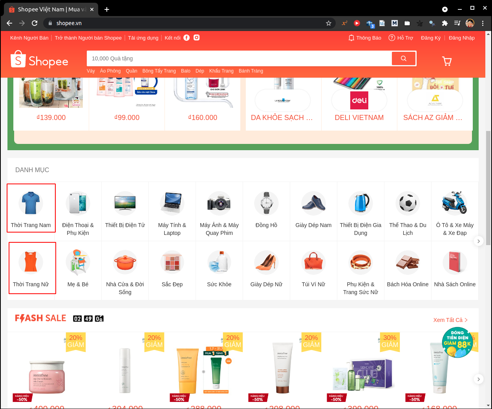

# 1. Giới thiệu về ngữ cảnh bài toán
* Trong thương mại điện tử, việc liên tục nâng cao chất lượng sản phẩm và dịch vụ để đáp ứng ngu cầu khách hàng nhằm nâng cao uy tín là công việc hàng đầu cua của các doanh nghiệp khi tham gia sàn thương mại điện tử.
* Hệ thống hỗ trợ doanh nghiệp phân loại các phản hồi của khách hàng thành hai nhóm: **positive** [nhóm khách hàng tích cực], kí hiệu <scan style="color: green">$\oplus$</scan> và **negative** [nhóm khách hàng tiêu cực], kí hiệu <scan style="color: red">$\ominus$</scan> dựa trên dữ liệu đầu vào dưới dạng **text** [tài liệu văn bản].
* Hệ thống được xây dựng dựa trên lịch sử những đánh giá của khách hàng đã có trước đó, dữ liệu được thu thập từ phần **comment** [bình luận] và **rank** [số sao (điểm) đánh giá cho sản phẩm] của khách hàng ở trang web thương mại điện tử từ một nhóm ngành nào đó.
* Hệ thống giúp doanh nghiệp có thể biết được những phản hồi nhanh chóng của khách hàng về sản phẩm, dịch vụ của họ, điều này giúp cho doanh nghiệp có thể hiểu được tình hình kinh doanh, hiểu được ý kiến của khách hàng từ đó giúp doanh nghiệp cải thiện hơn trong dịch vụ, sản phẩm.
* Ở đây, trang thương mại điện tử được dùng để crawl dữ liệu là [**Shopee Việt Nam**](https://shopee.vn/), dữ liệu được crawl về là những bình luận và đánh giá của khách hàng về các sản phẩm thuộc nhóm ngành thời trang.
  
# 2. Enviroment, editor (IDE), programming language & dependent packages và cấu trúc thư mục
* **OS**: Ubuntu 20.04 LTS
* **Programming language**: Python 3.6.8
* **Python's dependent packages**:
  ```shell
  pip3 install selenium==3.141.0
  ```
  _Một vài package khác có thể sẽ yêu cầu cài thêm trong quá trình install các package phía trên nên sẽ không liệt kê trong đây._
* **Editor**: VS-Code _(recommend)_, Jupyter Notebook, Jupyter Lab,...
* **Cấu trúc thư mục**:
  * Folder **modules** chứa các user defined function, class.
  * Folder **data** chứa các data mà ta crawl về, những data phát sinh sau bước pre-processing,...
  * Folder **image** chứa các hình minh họa.

# 3. Chi tiết vào project
## 3.1. Data scraping
* Khi truy cập vào trang chủ Shopee Việt Nam tại địa chỉ [https://shopee.vn](https://shopee.vn), khi kéo xuống một chút ta sẽ thấy được nhóm ngành thời trang như dưới đây:
  
* Vùng red square là những nhóm hàng mà ta sẽ tập trung crawl cũng như xây dựng model về sau.
* Một câu hỏi đặt ra là tại sao chúng ta không tạo ra một model mà nó có thể phân lớp cho toàn bộ tất cả các nhóm ngành trên trang thương mại điện tử này. Có một vài hạn chế như sau:
  * Việc chúng ta có gắng nhồi nhét toàn bộ các comment của các nhóm ngành khác nhau và bắt máy tính phải học một đống này sẽ khiến cho quá trình học trở nên phức tạp, khó khăn và tốn thời gian, đồng thời nếu có xây dựng được model thì chất lượng nó cũng sẽ không tốt khi ta evaluate nó hoặc ứng dụng vào thực tế về sau.
  * Các nhóm ngành khác nhau có những keyword khác nhau, ví dụ nhóm ngành thời trang sẽ có những keyword điển hình như: _vải xấu, áo mỏng, đổ lông,..._. Nhưng nếu trong nhóm ngành điện tử sẽ có những keyword như: _máy nóng, sạc không vô, chai pin,..._, nhưng giữa hai nhóm ngành thời trang và điện tử lại có những keyword chung như: _hàng không giống ảnh, giao sai màu, giao hàng chậm,..._ và điển hình ở các comment tích cực thì việc các keyword này overlap lên nhau thì càng nhiều hơn, ví dụ: _giao nhanh, sản phẩm tốt, chất lượng sản phẩm tuyệt vời,..._. Các comment tích cực hay có một xu hướng chung chung như vậy và không đề cập quá chi tiết về nhóm hàng mình đang đánh giá.
  * Và nếu ta muốn một hệ thống có thể ứng dụng được trên toàn bộ hệ thống các nhóm hàng, thì lúc này ta có thể làm như sau:
    * Giả sử ta là Shopee, thì ta biết rõ comment này thuộc sản phẩm nào và sản phẩm này thuộc nhóm hàng nào dựa vào các label, tag của sản phẩm, từ đó ta sẽ sử dụng model tương ứng cho nhóm hàng này để dự đoán.
    * Nếu ta không là Shopee, ta có thể xây dựng thêm một model-1 với input là comment của khách hàng, output là nhóm hàng mà comment này khả năng cao thuộc về. Sau đó ta mới bắt đầu đưa comment này vào model-2 tương ứng với nhóm hàng mà model-1 đề xuất và đánh giá comment này.
    Đây là một vài cách mà ta có thể ứng dụng. Thực tế thì các hệ thống này có khả năng cao phức tạp hơn nhiều, nhưng ở đây ta chỉ chú tâm vào nhóm hàng thời trang thôi. 

* File [00.scraping.ipynb](00.scraping.ipynb) chứa toán bộ mã nguồn và giải thích quá trình crawl data