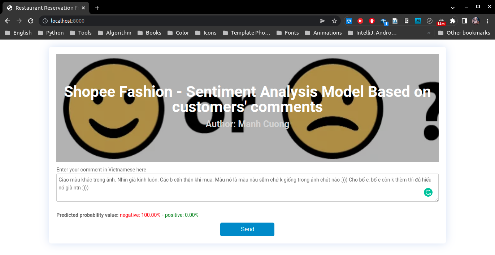

# 1. Description
* Hello guys, this is my small application used to predict comments are positive or negative.
* I used `selenium` to crawl the entire data from Shopee Vietnam with over than 23.000 records. Each record consists mainly of the client's comment and his number of stars for the his comment.
* After training phase and several model evaluation techniques, the model was embedded into web using Django framework.
* The main field that my app concentrate on is fashion. So if you try to force the model predict on a wrong data (such as technology comments, food comments,...), The possibility is that the model can not predict accurately.
* So, if you are interested in my application, you can read more the documents inside the directory `Docs`. I write with such a clarity and precision for what techniques I used.

# 2. Installation
* Firstly, you need to create a new **conda environment** using `python 3.8.10` and then activate the new environment which you have just created.
  ```bash
  conda create --name sentiment python==3.8.10 pip
  conda activate sentiment
  ```
* OK, open your terminal at the same level with file `requirements.txt` to install some python packages.
  ```bash
  pip install -r requirements.txt
  ```
* And then, change your directory to `web` directory.
  ```bash
  cd web
  ```
  and now, you are standing at path `.../SCL_KHVW_Sentiment_Analysis_Project/web/`
* Finally, you can run the Django application by the followed command.
  ```bash
  python manage.py runserver
  ```
  Because this application uses TensorFlow, SkLearn and some other heavy packages. So for the first time you run this app, it will take several seconds to load model and initialize some configuration, after that moment, the app can work smoothly.
* OK, open your favorite browser and go to url [http://localhost:8000](http://localhost:8000/), the super gorgeous interface of my app will appear like this 😅 (sorry front-end developers).
  

# 3. Demo and usage
* After you run the application successfully, enter your comment at the textarea component, then click the button **Send** and wait a bit to get the predicted result.
* Let's try with some positive comments.
  
  * With this comment, the model predict exactly. You can see **predicted probability of positive value** is higher than **negative value**, so really this is a positive comment.
  * Some images below for other positive comments.
    
    
    

* OK, let's try with some negative comments.
  * Let leave only the **thumbs-down** emoji to see how the model will deal with.
    
  * Some images below for other negative comments.
    
    
    
    

* OK, cool. Thank you so much. Let clone or download as zip my application and run on your machine. See you 😍.